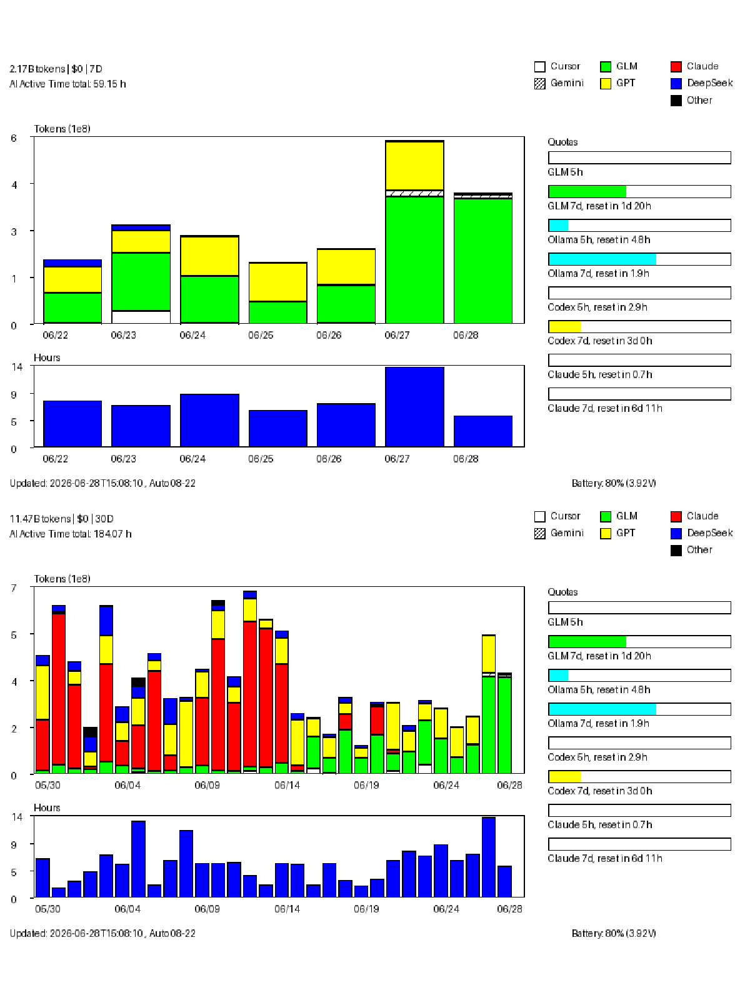

# reTerminal E1002 Arduino Sketch

This directory contains a minimal native-rendering POC sketch for the Seeed Studio reTerminal E1002. It is a reference implementation, not a required AI Usage Dashboard setup step.

## Preview

The screenshot below is generated by `eink_simulator.py` (a Python PIL renderer that mirrors the firmware layout) using real local data. The top half is 7-day mode, the bottom half is 30-day mode.



Note: the preview uses PIL's default bitmap font and saturated RGB colors that look harsh on a monitor. On the actual E1002 e-ink panel the rendering is crisp grayscale with clean bar outlines.

## Files

- `e1002.ino`: main sketch
- `driver.h`: Seeed_GFX E1002 screen selection using `BOARD_SCREEN_COMBO 521`
- `dashboard_types.h`: data structs (`DailyEntry`, `QuotaWindow`, `DashboardData`)
- `dashboard_network.h`: Wi-Fi, HTTP fetch, JSON parse
- `dashboard_logic.h`: view-mode math, formatting, provider colors
- `dashboard_render.h`: chart and quota panel rendering
- `secrets.h`: local Wi-Fi, dashboard URL, and device ID config; local only, ignored by git
- `secrets.h.example`: public placeholder template
- `preview.png`: simulator-generated screenshot (7d + 30d stacked)

## Opening In Arduino IDE

Only copy `secrets.h.example` to `secrets.h` when you intend to compile or flash the reTerminal E1002. Normal command-line usage does not need this file.

Open this file directly in Arduino IDE:

```text
eink/e1002/e1002.ino
```

Arduino will include `driver.h` and `secrets.h` from the same directory.

## Board Settings

- Board: `XIAO ESP32S3`
- ESP32 board package: `3.3.10`
- PSRAM: `OPI PSRAM`
- Flash Mode: `QIO 80MHz`
- Upload Speed: start with `115200`

E1002 uses `BOARD_SCREEN_COMBO 521` from `driver.h`. On this hardware, use `Serial1` on GPIO 44/43 for debug logs. Do not replace Arduino's bundled `ctags 5.8-arduino11` with Homebrew `universal-ctags`: Arduino's sketch preprocessor requires the bundled output format. If the tool was changed, restore it through Arduino/Board Manager and rebuild with `--clean`.

## Libraries

Install:

- `Seeed GFX`
- `ArduinoJson`

ESP32 core includes:

- `WiFi`
- `HTTPClient`

## Screen Layout (800x480)

The screen is split into two vertical zones:

**Left zone** (x=36..560, width 524):

- Title at y=14: `<tokens> tokens | $<cost> | 7D/30D`
- AI Active Time total at y=30, directly under the title
- Stacked token bar chart at y=92, height 200: 7 bars (7-day mode) or 30 bars (30-day mode), colored by provider (Cursor=white border, GLM=green, Gemini=striped white, Claude=red, GPT=yellow, DeepSeek=blue, Grok=dotted white, Qwen=reverse-striped white, Other=black)
- AI Active Hours chart at y=336, height 88: blue bars, same x-axis as the stacked chart
- Footer at y=456: `Updated: <timestamp> , Auto 08-22`

**Right zone** (x=585..780, width 195):

- Legend in the top-right header (y=12..48): colored 12x12 squares with labels
- `Quotas` header at y=92
- One horizontal usage bar per quota window, stacked vertically. Each bar is 14px tall with a filled colored portion (GLM=green, Ollama=cyan, Codex=yellow, Claude=red) and a black outline. Below each bar, one line of text: `<Provider> <label>, reset in Xd Yh` (or `reset in X.Yh` when less than a day remains). The reset countdown is computed from the NTP-synchronized local clock.
- Labels are compact: `5h` for 5-hour windows, `7d` for weekly windows
- Provider order: GLM, Ollama, Codex
- When no quota data is present the panel shows `--`

## Current Behavior

On boot, the sketch:

1. initializes the E1002 display
2. connects to Wi-Fi silently
3. requests the local dashboard update URL from `secrets.h`
4. synchronizes local time
5. reads local battery voltage and estimates battery percentage
6. parses the latest 30-day JSON and renders the dashboard in 7-day mode by default
7. enters light sleep and wakes every hour

Wake sources:

- **Timer**: wakes every hour by default; automatic network update happens only between 08:00 and 22:00.
- **Physical buttons**: the white button toggles 7D/30D; the green button forces an update.

## Interaction Model

- Default mode: last 7 days.
- Green button (`GPIO3`): force update from local FastAPI and return the latest JSON.
- White buttons (`GPIO4` / `GPIO5`): toggle 7-day and 30-day views using cached data only.
- Any button wake emits a very short confirmation tone.

The device stores the current view mode in RTC memory. White-button view switching does not make a network request.

## Python Simulator

`eink_simulator.py` (in the repo root) reproduces the firmware rendering in PIL, producing a PNG preview without needing hardware. It renders both 7-day and 30-day modes stacked into a single image.

```bash
.venv/bin/python eink_simulator.py
# writes tmp/e1002_simulator_preview.png (7d + 30d stacked, 800x960)
```

The simulator mirrors `dashboard_render.h` and `dashboard_logic.h` field-for-field. When the firmware layout changes, update the simulator to match and regenerate `preview.png`.

## First Flashing Tips

If upload is unstable:

1. Lower Upload Speed to `115200`.
2. Reconnect the USB cable.
3. Wake the device with a button before uploading.
4. If it still fails, hold `BOOT` and click Upload.

## Notes

- `secrets.h` contains local Wi-Fi credentials and must not be committed.
- The title uses a compact format such as `2.07B tokens | $50 | 7D` to avoid legend overlap.
- Startup does not show intermediate status pages; success goes directly to the final visualization.
- Battery percentage is estimated from `GPIO21 -> GPIO1 ADC` voltage readings and calibration, not from a fuel gauge.
- Green and white buttons are configured as light-sleep wake sources.
- The buzzer uses `GPIO45` for short wake confirmation tones.
- The device uses light sleep; the automatic update window is controlled by synchronized local time.
- Compile: `arduino-cli compile --clean --fqbn esp32:esp32:XIAO_ESP32S3:PSRAM=opi,FlashMode=qio,UploadSpeed=115200,USBMode=default,CDCOnBoot=cdc eink/e1002/e1002.ino`
